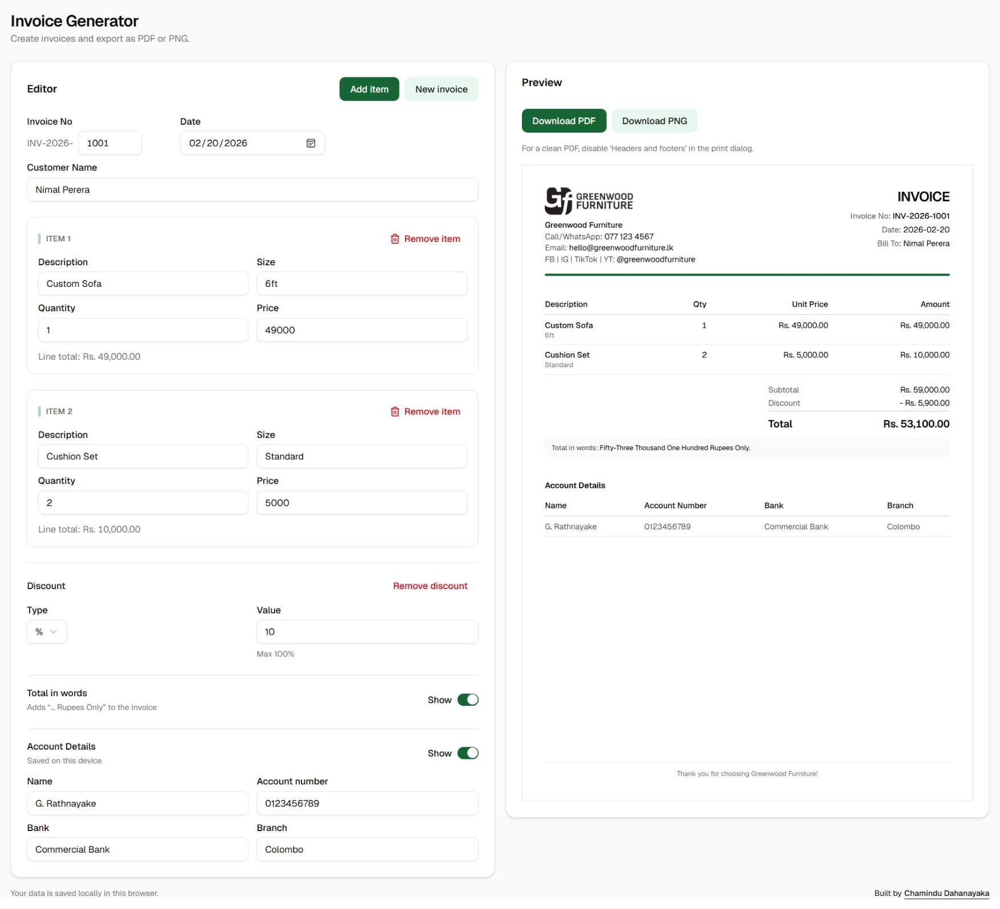

# Invoice Generator (Next.js)

A mobile-first invoice generator built for small businesses. Create an invoice with line items, optional discount, optional bank details, and export as **A4 PDF** or **PNG**.

**Live Demo:**

[https://a4-invoice-generator.vercel.app/](https://a4-invoice-generator.vercel.app/)

## Features

- Live A4 preview (consistent across devices)
- Line items: description, size, quantity, unit price (auto line total)
- Optional discount (Rs. or %)
- Optional account/bank details section (saved on this device)
- Invoice number (auto incremental per device)
- Customer name + date
- Total in words (English)
- Export:
  - **PNG** download
  - **PDF** via print view (`/print`) for clean A4 output

## Screenshot



## Tech Stack

- Next.js (App Router) + TypeScript
- Tailwind CSS
- shadcn/ui
- html-to-image (PNG export)

## Getting Started

```bash
npm install
npm run dev
```

Open [http://localhost:3000](http://localhost:3000) with your browser to see the result.

## Build

```bash
npm run build
npm start
```

## Notes

- Invoice data and settings are stored in `localStorage` (this browser/device only).
- For the cleanest PDF: in the print dialog, disable **Headers and footers**.

## Author

- Portfolio - [Chamindu Dahanayaka](https://chamindud.github.io/my-portfolio/)
- Frontend Mentor - [@ChaminduD](https://www.frontendmentor.io/profile/ChaminduD)
- LinkedIn - [Chamindu Dahanayaka](https://www.linkedin.com/in/chamindudahanayaka/)

## License

MIT © 2026 Chamindu Dahanayaka